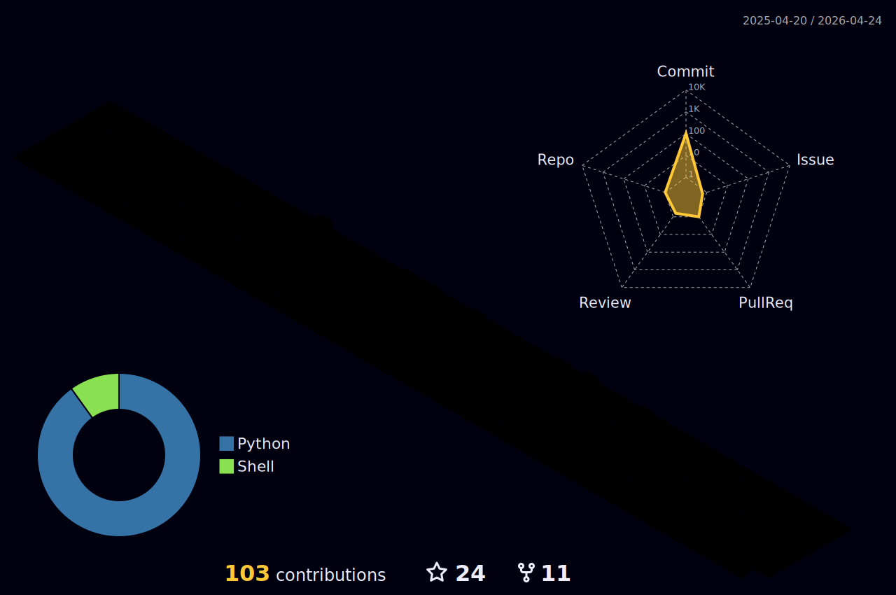

<!---->

  
  <!--
   -->
  

    

<h1 align="center">  I'm Albert Solomon Phiri / The IT Howler.</h1>

<h3 align="center">A passionate Full Stack Software Engineer who thrives at solving problems </h3>

<!---->

<!--

    - 🌱 I’m currently learning React, Typescript, Node.js, Go and Rust

    - 💬 Ask me about Python, django and Front-End Development.

    - ⚡ Fun fact I love ❤️ learning new things (New Technologies)

 -->

<!---->

<h3 align="center">⚡ STATS ⚡</h3>

  
  
  

<!--

-->
